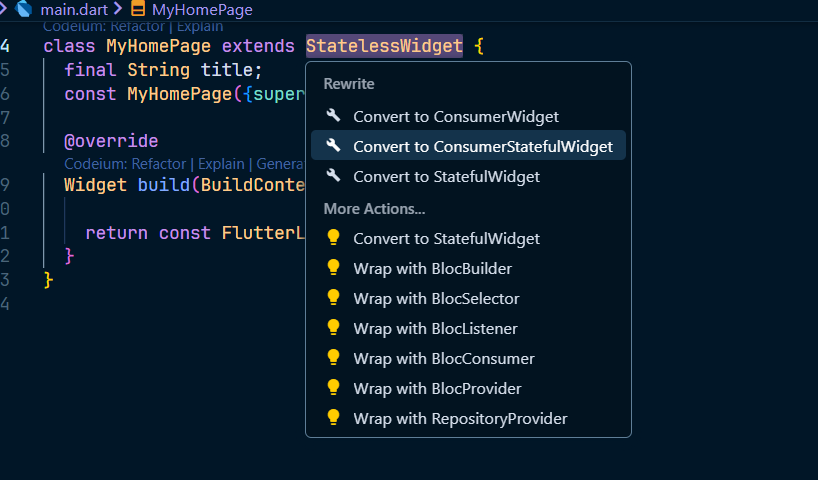
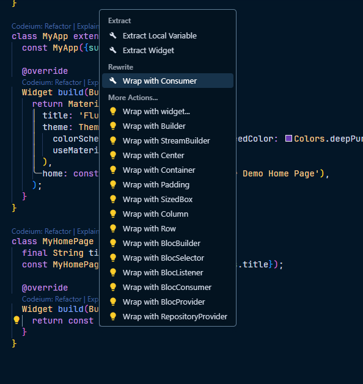
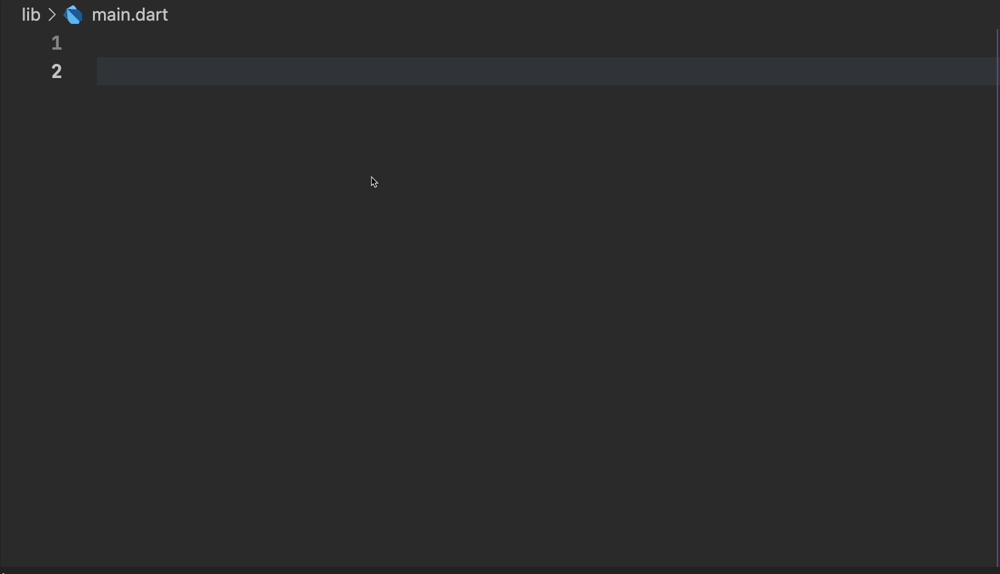

# Riverpod Widget Refactor
[Link to install](https://marketplace.visualstudio.com/items?itemName=QuangTrung.riverpod-widget-refactor&ssr=false#review-details)
---

flutter riverpod extension is an extension that offers flutter_riverpod related code actions and snippets to increase productivity and make development easier.

## Code Actions

- Convert to a ConsumerWidget
- Convert to a StatelessWidget
- Convert to a StatefulWidget
- Convert to a ConsumerStatefulWidget
- Wrap with consumer

## Remarks

- Imports are managed automatically (no more adding import statements)

## Note

I A Big Thank You! 🎉
I stolen code from those repositoires:

- https://github.com/yhbsh/Riverpod-Extension-For-VsCode
- https://github.com/felangel/bloc
- https://marketplace.visualstudio.com/items?itemName=GaganYadav.rp-consumer
- chatGPT

Iam someone who knows nothing about TypeScript and programming extensions for VSCode. I worked on this for 2 days, so this repository is not perfect.

**Please create a Pull Request if you can help me improve it!**  
**Please create a Pull Request if you can help me improve it!**  
**Please create a Pull Request if you can help me improve it!**  
**Please create a Pull Request if you can help me improve it!**  
**Please create a Pull Request if you can help me improve it!**
